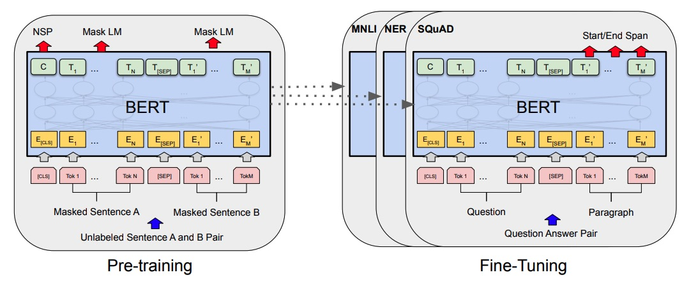
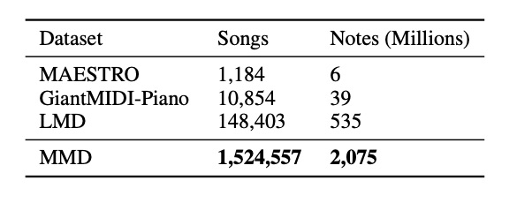

 MusicBERT é un modelo preentrenado a gran escala para a comprensión musical no campo do  Deep  Learning e as redes neuronais que son un dos desenvolvementos  computacionais implementados na investigación musical e que serven básicamente para aplicacións musicais de tipo clasificar xéneros,  emocións, recomendar cancións, predecir búsquedas, etc...por citar algúns exemplos. Estas aplicacións fanse a partir da comprensión da música simbólica. A comprensión da música simbólica,  refírese á comprensión da música a partir dos datos simbólicos (p. ex., formato  MIDI, pero non audio). 

En 2021 un grupo de científicos que traballan para Microsoft Asia, construíron un corpus de música simbólica, que contén máis dun millón de cancións musicais, de diferentes xéneros, incluídos Rock, Clásica, Rap, Electrónica, Jazz, etc..
A música simbólica contén dous tipos de información, unha estruturada p. ex. compás ou posición e outra diversa p. ex. tempo, instrumento ou ton. 
Os experimentos demostraron que  MusicBERT proporcionaba vantaxes en catro tarefas fundamentais da comprensión musical, isto é:
- finalización dunha melodía
- suxerencia de acompañamento
- clasificación de xénero
- clasificación de estilo

É necesario un conxunto de datos musicais a gran escala para aprender boas representacións musicais a partir do  preentrenamiento.
Con todo, os conxuntos de datos musicais simbólicos anteriores son
adoitan ser de pequena escala: 1) o conxunto de datos MESTRE
( Hawthorne  et ao., 2019) contén só mil interpretacións de piano; 2) o conxunto de datos  GiantMIDI-Piano ( Kong  et ao., 2020a, b) contén un número lixeiramente maior lixeiramente maior, pero só dez mil interpretacións de piano; 3) o maior conxunto de datos de música simbólica de código aberto simbólica de código aberto é o conxunto de datos  Lakh- MIDI ( LMD) ( Raffel, 2016), que contén ao redor de 100 K cancións.
Para  preentrenar un modelo potente con boas representacións musicais representacións musicais, construímos un corpus musical
de música simbólica a gran escala con máis de 1,5 millóns de cancións. En concreto, primeiro rastrexamos unha gran cantidade de arquivos musicais, limpamos os arquivos mal formados ou en branco, e logo converter eses arquivos na nosa codificación musical simbólica.
Como a codificación  OctupleMIDI é universal a maioría dos arquivos  MIDI pódense converter á nosa codificación sen que se produza unha perda notable de información musical.
Descubrimos que estes arquivos musicais poden ter un contido musical case idéntico aínda que os seus valores  *hash* sexan diferentes. Por tanto, desenvolvemos unha forma eficiente de  deduplicarlos: primeiro omitimos todos os elementos excepto o instrumento e o ton na codificación, e logo obtemos os valores  hash da secuencia restante e utilizámola como pegada dixital deste arquivo de música, que logo se utiliza para a deduplicación. Tras a limpeza e a  deduplicación, obtivemos 1,5 millóns de cancións con 2.000 millóns de  tokens de óctuplo (notas musicais). Denominamos o noso conxunto de datos como  Million- MIDI  Dataset ( MMD). En comparamos os tamaños dos distintos conxuntos de datos musicais en 
tabla 2:

Na táboa 2,  os tamaños dos diferentes conxuntos de datos musicais. Dado que  LMD tamén se compón de arquivos  MIDI de varios sitios web, realizouse o mesmo proceso de limpeza e  deduplicación que en  MMD e obtemos 148.403 cancións en  LMD.

Para finalizar, MusicBERT, é un modelo  preentrenado a gran escala para a comprensión da música simbólica. En lugar de adoptar simplemente os métodos de  preentrenamiento da PNL(Programación Neuro Linguística) para a música simbólica, que manexa os desafíos distintivos no  preentrenamiento da música con varios deseños coidadosos en  MusicBERT, incluíndo a codificación eficiente e universal  OctupleMIDI, a estratexia efectiva de  enmascaramiento a nivel de barra, e o corpus de música simbólica a gran escala con máis de 1 millón de cancións musicais.  MusicBERT logra un rendemento de vangarda nas catro tarefas de comprensión de música simbólica avaliadas, incluíndo a finalización de melodías, a suxerencia de acompañamentos, a clasificación de xéneros e a clasificación de estilos. As análises do método tamén verifican a eficacia de cada deseño en  MusicBERT. No futuro, aplicaremos  MusicBERT a outras tarefas de comprensión musical, como o recoñecemento de acordes e a análise da estrutura para mellorar o rendemento.

[Fonte: MusicBERT](https://arxiv.org/pdf/2106.05630.pdf)

