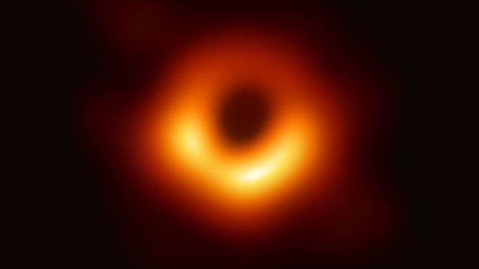
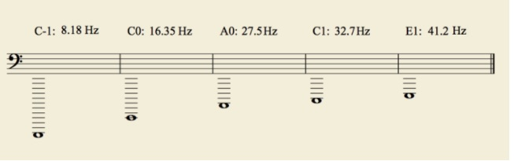
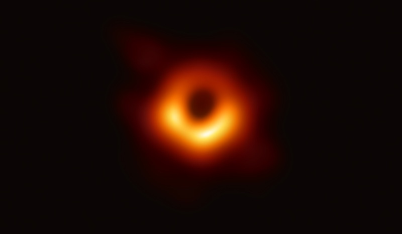
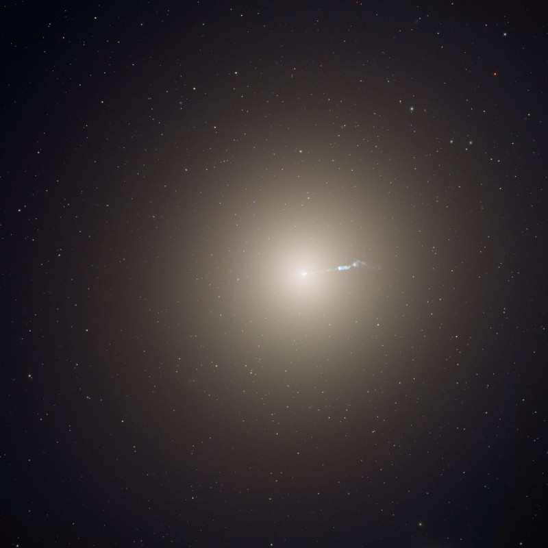

## Cal é o son máis grave da natureza?

Un dos sentidos principais do home, como todos sabemos, é o sentido do oído. Este sentido, permítenos mediante un proceso físico-fisiolóxico-psíquico aprehender unha das dimensións da realidade, a dimensión acústica. 
O rango sonoro do noso oído, dunha maneira moi xeral, estaría entre as frecuencias de 20  Hz e os 20000  Hz. 
Imos deixar ao carón os ruídos e sons xerados na nosa vida cotiá e poñer a nosa atención nos sons xerados por algúns instrumentos musicais. Desta maneira, podemos construír un modelo de comprensión que nos permita comprender e entender mellor as dimensións do fenómeno acústico do que imos dar conta neste artigo. 

> O buraco negro, un dos máis grandes do universo, atópase no centro de  M87, unha galaxia elíptica próxima dentro do cúmulo de galaxias de Virgo. Os científicos detectaron bucles e aneis no gas quente que emite raios X que rodea a galaxia e impregna o cúmulo. Estas características proporcionan evidencia de erupcións periódicas que ocorreron preto do buraco negro  supermasivo e xeraron ondas de presión no gas que se manifestan como son.

## Instrumentos musicais
Se pensásemos nos sons máis graves dunha orquestra, o primeiro que se nos viría á cabeza sería o son producido polo contrabaixo, o instrumento da familia dos violíns máis grande. Pero en esencia, este termo non é moi preciso debido a que 'contrabaixo' puidese ser calquera instrumento capaz de producir son no rexistro que se considera baixo entre 30  Hz e os 294  Hz aproximadamente.
A nota máis grave dun piano sería un 'La' (A0-27.50 Hz). 

<iframe width="100%" height="300" scrolling="no" frameborder="no" allow="autoplay" src="https://w.soundcloud.com/player/?url=https%3A//api.soundcloud.com/tracks/671583782&color=%23182a92&auto_play=false&hide_related=false&show_comments=true&show_user=true&show_reposts=false&show_teaser=true&visual=true"></iframe>
<a href="https://soundcloud.com/bethuelson" title="손슬기(Seulgi)" target="_blank" style="color: #cccccc; text-decoration: none;">손슬기(Seulgi)</a> · <a href="https://soundcloud.com/bethuelson/piano-hit-a0-1-2019-05-29" title="Piano Hit A0 1 [2019 - 05 - 29 142809]" target="_blank" style="color: #cccccc; text-decoration: none;">Piano Hit A0 1 [2019 - 05 - 29 142809]</a>

Aínda que este rango superaríano algúns órganos e o piano Imperial  Bösendorfer coas súas teclas negras capaces de facer soar unha sexta máis grave que o 'La' (A0) é dicir, un 'Do' C0.

<iframe width="960" height="315" src="https://www.youtube.com/embed/ORho0WyjtGk" title="YouTube video player" frameborder="0" allow="accelerometer; autoplay; clipboard-write; encrypted-media; gyroscope; picture-in-picture" allowfullscreen></iframe>

Nos instrumentos de metal, a tuba cun bo  instrumentista polo medio podería chegar a este rexistro tan baixo, pero cunha dinámica moi débil.

<iframe width="960" height="315" src="https://www.youtube.com/embed/REBMyEZ9j3Y" title="YouTube video player" frameborder="0" allow="accelerometer; autoplay; clipboard-write; encrypted-media; gyroscope; picture-in-picture" allowfullscreen></iframe>

Un contrabaixo (doublebass) podería alcanzar o B1 o que quere dicir que case estaría por encima do  C0 unha oitava.

<iframe width="960" height="315" src="https://www.youtube.com/embed/cW7wxLnZFCA?start=105" title="YouTube video player" frameborder="0" allow="accelerometer; autoplay; clipboard-write; encrypted-media; gyroscope; picture-in-picture" allowfullscreen></iframe>

Outro instrumento que podería alcanzar estes rangos foi o clarinete octocontrabajo e que se saiba só existe un, fabricado polo  luthier  G.  Leblanc e rexistrado no libro  Guinnes dos récords como o instrumento  orquestral capaz de producir a nota máis grave un case  infra-son chamado Sib-1 coa súa frecuencia 14.57 Hz e claramente fose do limiar  normal de escoita do oído humano. Aínda que só se fixo un, existen tres obras para  clarinet  octocontrabajo e orquestra.

<iframe width="960" height="315" src="https://www.youtube.com/embed/AsawO9dsZ8g?start=59" title="YouTube video player" frameborder="0" allow="accelerometer; autoplay; clipboard-write; encrypted-media; gyroscope; picture-in-picture" allowfullscreen></iframe>

Así mesmo, en Sydney atopámonos cun órgano que baixa ata un  C-1 (8.18 Hz). O seu tubo máis longo mide un 19m.

<iframe width="960" height="315" src="https://www.youtube.com/embed/wwmcIesEkQ0?start=414" title="YouTube video player" frameborder="0" allow="accelerometer; autoplay; clipboard-write; encrypted-media; gyroscope; picture-in-picture" allowfullscreen></iframe>

Para rematar esta sección facemos un resumo representando no pentagrama o escrito ata o de agora polos instrumentos:

- C-1: Órgano del Town Hall de Sidney
- C0: Piano Bösendorf
- A0: Piano convencional
- C1: Primer traste en un bajo de cinco o seis cuerdas
- E1: Cuarta cuerda al aire de un bajo convencional de 4 cuerdas

## M87 a lira de Deus

A galaxia  m84, é hoxe ben coñecida por varias razóns. Unha destas, foi porque no ano 2019 fíxose pública a primeira imaxe de radio dun buraco negro, na galaxia  M87. Esta imaxe buscada durante moito tempo proporciona a evidencia máis sólida ata a data da existencia de buracos negros  supermasivos e abre unha nova xanela ao estudo dos buracos negros, os seus horizontes de eventos e a gravidade. 

Imaxe vía  Event  Horizon  Telescope  Collaboration.

O Powehi, que así é como se lle chamou a este buraco negro, do tamaño do noso sistema solar e que está no centro da galaxia m87, a 53 millóns de anos luz (aproximadamente 500 billóns de billóns de quilómetros) de distancia. Os estudos realizados, indican que no bordo do buraco negro, os ondas magnéticas son tan  descomunalmente fortes, que o gas circundante resista á gravidade do propio buraco. Isto provoca a súa expulsión cara ao exterior impulsando poderosos chorros que se estenden moito máis alá da galaxia.
 Imaxe a través do equipo de NASA /ESA/ Hubble  Heritage.

     Imaxe a través do equipo de NASA /ESA/ Hubble  Heritage.