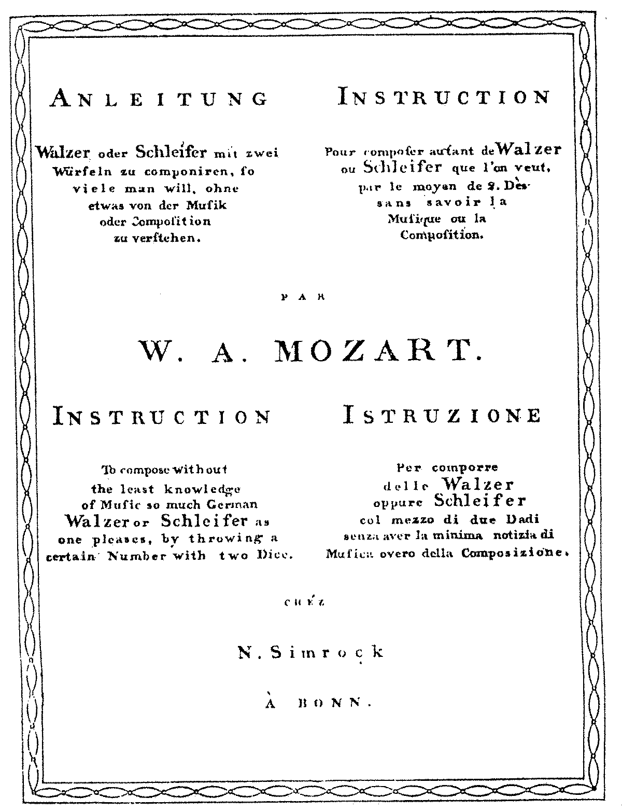

## A orixen da música algorítmica.

En 1793, menos de dous anos despois da morte de Mozart, publicouse  (e se  reimprimió en  Bonn tres anos despois), *Wuerfelspiel* orixinal para piano en do maior. É moi probable que Mozart deseñase  Wuerfelspiel él mesmo (aínda que isto non ten o consenso de toda a comunidade investigadora da obra do compositor  salzburgués) , xa que ocasionalmente lidaba con tales trucos, como o demostra, por exemplo,  a folla de bosquexos para Adagio  KV 516. 
> O Grove de 1936 dedica media páxina a "As obras  espurias e dubidosas" de Mozart. Menciona "a gran cantidade de pezas para piano falsas", pero non menciona o  Musikalische  Wuerfelspiel.

Este *adagio* contén un bosquexo dunha voz de  minueto, cuxos grupos de barras están dispostos por letras nunha forma similar á da peza musical  Wuerfelspiel. Esta obra é unha melodía de  minueto cuxos compases se ordenaron por medio de letras nunha forma similar á do xogo de dados de  Wuerfelspiel.
A Academia  Galega dá  Lingua define algoritmo como *un conxunto de  regras que,  ao  aplicalas, permiten resolver un problema mediante un número finito de  operacións*.

Quizais este valse de Mozart sexa a primeira peza musical baseada nun algoritmo, empregue a estocástica e teña  concepción formal de obra aberta. Isto convértea en pioneira no uso de técnicas de composición máis propias do século  XX que do clasicismo  vienés  dieciochesco.
As instrucións orixinais eran que o xogador lanzase dous dados para seleccionar ao azar unha alternativa para cada medida. Este método, por suposto, non lle dá a cada alternativa de medida a mesma oportunidade de ser elixida, xa que 7 aparece con moita máis frecuencia que 2 ou 12, por exemplo. O proceso de selección utilizado aquí dá a mesma oportunidade a cada unha das 11 alternativas. 

Poderiamos dicir, xeneralizando moito, que a música xerada por computadora apareceu na década dos cincuenta do século pasado, uns poucos anos despois de 1943, cando se iniciou a construción do primeiro computador de propósito xeral baseado en circuítos electrónicos, o ENIAC (acrónimo de  Electronic  Numerical  Integrator  And  Computer) en Filadelfia, o cal era un  mastodonte de 27 toneladas de peso, que ocupaba unha superficie de 167 m² e que contaba con 17.500 válvulas sen carga, 7.200  diodos de cristal, 1.500  relés, 70.000 resistencias, 10.000  condensadores e cinco millóns de soldaduras. 
E é que The  Illiac Suite é a primeira partitura composta para unha computadora, un exemplo temperán de algoritmo musical nunha composición musical, facendo uso de modelos aleatorios para a xeración de son, así como regras para filtrar material xerado de acordo con certas indicacións desexadas .
