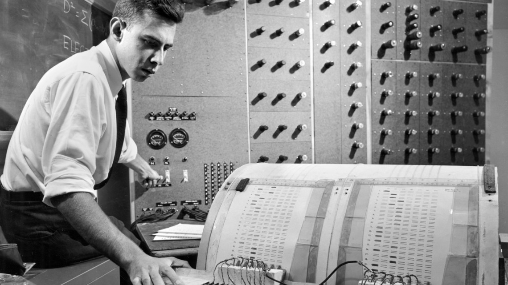

# A orixe da música algorítmica.

En 1793, menos de dous anos despois da morte de Mozart, publicouse  (e se  reimprimió en  Bonn tres anos despois), *Wuerfelspiel* orixinal para piano en do maior. É moi probable que Mozart deseñase  Wuerfelspiel él mesmo (aínda que isto non ten o consenso de toda a comunidade investigadora da obra do compositor  salzburgués) , xa que ocasionalmente lidaba con tales trucos, como o demostra, por exemplo,  a folla de bosquexos para Adagio  KV 516. 
> O Grove de 1936 dedica media páxina a "As obras  espurias e dubidosas" de Mozart. Menciona "a gran cantidade de pezas para piano falsas", pero non menciona o  Musikalische  Wuerfelspiel.

Este *adagio* contén un bosquexo dunha voz de  minueto, cuxos grupos de barras están dispostos por letras nunha forma similar á da peza musical  Wuerfelspiel. Esta obra é unha melodía de  minueto cuxos compases se ordenaron por medio de letras nunha forma similar á do xogo de dados de  Wuerfelspiel.
A Academia  Galega dá  Lingua define algoritmo como *un conxunto de  regras que,  ao  aplicalas, permiten resolver un problema mediante un número finito de  operacións*.

Quizais este valse de Mozart sexa a primeira peza musical baseada nun algoritmo, empregue a estocástica e teña  concepción formal de obra aberta. Isto convértea en pioneira no uso de técnicas de composición máis propias do século  XX que do clasicismo  vienés  dieciochesco.
As instrucións orixinais eran que o xogador lanzase dous dados para seleccionar ao azar unha alternativa para cada medida. Este método, por suposto, non lle dá a cada alternativa de medida a mesma oportunidade de ser elixida, xa que 7 aparece con moita máis frecuencia que 2 ou 12, por exemplo. O proceso de selección utilizado aquí dá a mesma oportunidade a cada unha das 11 alternativas. 

Poderiamos dicir, xeneralizando moito, que a música xerada por computadora apareceu na década dos cincuenta do século pasado, uns poucos anos despois de 1943, cando se iniciou a construción do primeiro computador de propósito xeral baseado en circuítos electrónicos, o ENIAC (acrónimo de  Electronic  Numerical  Integrator  And  Computer) en Filadelfia, o cal era un  mastodonte de 27 toneladas de peso, que ocupaba unha superficie de 167 m² e que contaba con 17.500 válvulas sen carga, 7.200  diodos de cristal, 1.500  relés, 70.000 resistencias, 10.000  condensadores e cinco millóns de soldaduras. 

E é que The  Illiac Suite é a primeira partitura composta para unha computadora, un exemplo temperán de algoritmo musical nunha composición musical, facendo uso de modelos aleatorios para a xeración de son, así como regras para filtrar material xerado de acordo con certas indicacións desexadas .

<iframe width="940" height="315" src="https://www.youtube.com/embed/0F75bckGBA0" title="YouTube video player" frameborder="0" allow="accelerometer; autoplay; clipboard-write; encrypted-media; gyroscope; picture-in-picture" allowfullscreen></iframe>

# Breve historia das redes neuronais

O ano 1943, ademais de ser o ano de fabricación do primeiro  computador de carácter xeral como diciamos máis arriba, Walter  Pitts un matemático e Warren  MacCulloch  neurofisiólogo, desenvolveron un modelo algorítmico a partir dunha neurona artificial. O feito era o de representar matematicamente un modelo simplificado dunha neurona real. 

Este traballo tivo continuidade noutro científico pioneiro deste campo do coñecemento na persoa de Frank  Rosenblatt.  Rosenblatt desenvolveu a capacidade de aprender ás neuronas artificiais do modelo Pitts-MacCulloch cun algoritmo que se chamou 'perceptrón', que en  reaidad é unha función que pode decidir se unha entrada, representada por un  vector de números, pertence ou non a unha clase específica. 

O algoritmo  perceptrón foi inventado en 1958 no Laboratorio Aeronáutico de  Cornell por Frank  Rosenblatt, financiado pola Oficina de Investigación Naval dos Estados Unidos . 

O  perceptrón estaba destinado a ser unha máquina, en lugar dun programa, e aínda que a súa primeira implementación foi en software para  *IBM 704*, posteriormente implementouse en hardware personalizado como o *perceptrón Mark 1*. Esta máquina foi deseñada para o recoñecemento de imaxes : tiña unha matriz de 400  fotocélulas, conectadas aleatoriamente ás "neuronas". Os pesos codificáronse en  potenciómetros e as actualizacións de peso durante a aprendizaxe realizáronse mediante motores eléctricos.  

> Ahora estamos a punto de presenciar el nacimiento de una máquina de este tipo, una máquina capaz de percibir, reconocer e identificar su entorno sin ningún entrenamiento o control humano. (Rosenblatt)

Pero a pesar destes avances en intelixencia artificial, durante ao redor de vinte anos a comunidade académica deixou de lado os estudos de  Rosenblatt pois creron que nunca chegarían a ter o grao de complexidade que posúe a mente humana.
E foi na década dos anos oitenta cando rexorde con forza o desenvolvemento da intelixencia artificial novamente.
O traballo máis importante en redes neuronais dos últimos 45 anos foi a obra  de David  Rumelhart e James  McClellan, *Parallel  distributed  processing:  explorations  in  the  microstructure  of  cognition.  Vol. 1.  Foundations.  Vol. 2.  Psychological  and  biological  models.*, publicada por *Cambridge  MA:  M.I. T.  Press* en 1987. 
A idea de base que utilizaron  Rumelhart , é que os programas de computador tradicionais funcionan de maneira moi distinta aos cerebros humanos, e esa podería ser a razón pola cal os programas de computadora foran (ata ese momento) tan deficientes para facer cousas que os cerebros atopan fáciles (como recoñecer obxectos en imaxes). Os autores afirmaron que o seu enfoque estaba *máis preto que outros marcos* de como funciona o cerebro e, por tanto, podería manexar mellor este tipo de tarefas. Actualemente este é o enfoque desenvolvido no eido das redes neuronais baseado nos seguintes requerimentos:

- Un conxunto de unidades de procesamento.
- Un estado de activación
- Unha función de saída para cada unidade
- Un patrón de conectividade entre unidades.
- Unha regra de propagación para propagar patróns de actividades a  través da rede de conectividades
- Unha regra de activación para combinar as entradas que inciden nunha unidade co estado actual desa unidade para producir unha saída para a unidade.
- Unha regra de aprendizaxe mediante a cal os patróns de conectividade son modificados pola experiencia.
- Unha contorna dentro do cal o sistema debe operar.

Hoxe día, as redes neuronais están a alcanzar o seu máximo desenvolvemento debido ao uso cada vez maior, de máis capas, o desenvolvemento exponencial da capacidade de procesamento de computadores e dispositivos informáticos, a dispoñibilidade de datos sobre todo pola xeneralización da internet e por último, aos cada vez mellores e máis desenvolvidos algoritmos e cada vez estamos máis preto do que predixo  Rosenblatt, crear:

> *Unha máquina capaz de percibir, recoñecer e identificar a súa contorna sen ningún adestramento ou control humano*

## ¿Cuál é a relación da música e a IA hoxe en día?

O que moita xente descoñece é que a música xenerativa ou a música xerada por máquinas informáticas xa se realizaba na década dos anos cincuenta do século pasado. Obviamente eran outras formas as empregadas por aqueles pioneiros  para o emprego da intelixencia artificial, como a  estocástica de  Markov, gramáticas xenerativas ou sistemas baseados en regras. Aínda que o que marca a diferenza ao de agora con hai setenta anos, é por unha banda o desenvolvemento das máquinas, feito fundamental porque permiten unha velocidade e un procesamento de datos enorme e por outro, a sofisticación dos algoritmos. Pola contra, tarefas en esencia seguen sendo iguais.
As interfaces de voz están a ter un gran desenvolvemento, porque permitirán posibilitar a interacción dos humanos cos obxectos sen tocar as pantallas. Estes asistentes  conversacionales van ter un papel fundamental no futuro en todos os ámbitos. Correlativamente, o que é unha realidade son as semellanzas entre a  IA aplicada á voz e a  IA aplicada á música. O por que isto é así é,en primeiro lugar é polos datos. Os datos é o mesmo, temos sons, o son da voz e o son da música. Desta maneira o que se fai non é traballar directamente sobre a onda sonora senón, sobre unha representación gráfica do son, a través dunha transformada de  Fourier. É dicir, pasamos dun obxecto auditivo a un visual a través dunha representación espacial-temporal por medio dun  sonograma ou  espectograma onde se representan dunha forma moi compacta o tempo e a frecuencia. Estes  espectogramas a continuación pásanse a algoritmos por exemplo regresión ou clasificación tanto no procesamento da música como da voz.
Así tamén, existe outro procesado de son empregado en música aínda que procede do da voz que se chama  MFCC, e é unha representación do espectro de potencia a curto prazo dun son, baseado nunha transformada de  coseno lineal dun espectro de potencia  logarítmica nunha escala de frecuencia  mel non lineal.
As interfaces de voz están a ter un gran desenvolvemento, porque permitirán posibilitar a interacción dos humanos cos obxectos sen tocar as pantallas. Estes asistentes  conversacionales van ter un papel fundamental no futuro en todos os ámbitos. Correlativamente, o que é unha realidade son as semellanzas entre a  IA aplicada á voz e a  IA aplicada á música. O por que isto é así é, primeiro polos datos. Os datos é o mesmo, temos sons, o son da voz e o son da música. Desta maneira o que se fai énos traballar directamente sobre a onda sonora senón, por unha representación gráfica do son, a través dunha transformada de  Fourier. É dicir, pasamos dun obxecto  auditivo a un visual a través dunha representación espacial-temporal por medio dun  sonograma ou  espectograma onde se representan dunha forma moi compacta o tempo e a frecuencia. Estes  espectogramas a continuación pásanse a algoritmos por exemplo regresión ou clasificación tanto no procesamento da música como da voz.
Así tamén, existe outro procesado de son empregado en música aínda que procede do da voz que se chama  MFCC, é unha representación do espectro de potencia a curto prazo dun son, baseado nunha transformada de coseno lineal dun espectro de potencia logarítmica nunha escala de frecuencia  mel non lineal .
Os  MFCC xa  non son alleos á nosa vida cotiá, e utilízanse habitualmente nos sistemas de recoñecemento de voz, como os sistemas que poden recoñecer automaticamente os números falados nun teléfono.
Os  MFCC tamén están a atopar cada vez úsanse máis en aplicacións de recuperación de información musical , como a clasificación de xéneros , as medidas de similitude de audio, etc. 

Grosso modo, poderíase dicir que a música no campo da  IA móvese en diferentes direccións. Está claro, que popularmente a maior parte das persoas que teñen algunha idea superficial sobre este tema, tenderán a pensar que a  IA é unha método utilizado por non músicos -enxeñeiros, matemáticos, programadores, etc..- para crear música  cun computador. 
Aínda que isto é así en parte, non deixa de ser unha simplificación e en último termo un descoñecemento do que significa a implementación da  IA en todos os ámbitos do saber e da cultura. 
De calquera forma, hai xente que pensa que a AI nunca  substituirá aos músicos e verdadeiramente seguro que será así, porque a música como a capacidade para materializar e comunicar emocións que nos permite gozar dunha experiencia estética, de momento e nun futuro próximo, a computación aínda está moi lonxe de conseguir.
Pero aínda asumindo que isto puidese ser real nun futuro, -a capacidade de articular emocións (a expresión musical)-, poderiamos preguntarnos, Ten algún sentido unha música baleira do seu contexto social, económico, político, cultural, afectivo, etc..? Quizá ironicamente poderiamos pensar en que esta música desposuída de toda humanidade tería un sentido nun mundo  deshumanizado, e dicir que a música só son 'formas sonoras en movemento' como a definiría  Hanslick no século  XIX. Pero a expresión humana debería ter algo máis que só a mera perfección formal. 
Epicureo no século III antes de Cristo xa se referiu á música resaltando o seu trazo máis distintivo, o da súa emocional humanidade á que definiu como vehículo de emocións e sentimentos experimentados polos seres humanos. 
No século  XVIII e en plena efervescencia racionalista e ilustrada, Rousseau e  Kant estaban de acordo en afirmar que a música non ten contido racional, nin fala ao intelecto, soamente opera no noso sistema afectivo.
Sen querer penetrarnos en cuestións que teñen máis que ver coa estética e o pensamento musical e que non corresponde ás intencións deste artigo divulgativo, pasaremos a relatar de seguido, como a AI e a música hoxe día camiñan xuntos por diversos itinerarios que en moitos casos  prefiguran o futuro da música e a tecnoloxía.
A continuación, daremos conta de modo moi superficial dalgunhas destas aplicacións en diversas áreas como a composición, a industria e a educación-investigación.

### O uso da AI na composición de música.

As interfaces de voz 
Huawei utilizou o seu teléfono intelixente Mate 20 Prol para completar a Sinfonía Non.8, coñecida como 'Inacabada'. Composta por Franz Schubert hai dous séculos. Desta sinfonía só lle deu tempo a completar o primeiro e segundo movementos , mentres que o terceiro e cuarto quedaron incompletos en forma dun borrador.
Este proxecto desenvolveuse orixinalmente como unha demostración do poder do novo  chipset  Kirin 980, no que se baseaba o   Huawei Mate e o uso da  IA en varios campos de actividade.
A primeira etapa foi unha análise da rede neuronal de 90 obras de Schubert en formato  MIDI para determinar os patróns principais e a estrutura das obras do compositor. Logo, a rede neuronal adestrouse nas obras de compositores que influíron en Schubert, o que lle deu á  IA un contexto máis profundo.
A etapa final do adestramento foi a análise do ton, timbre e dimensión das dúas partes completadas da peza. Despois diso, a  IA sintetizou a melodía da terceira e cuarta partes sobre a base da información recompilada.
Logo, á  IA uníronse o compositor gañador do premio  Emmy Lucas Cantor e un empregado de  DreamWorks  Animation que corrixiu os erros de melodía, agregou máis expresión e escribiu a partitura orquestral. O traballo do compositor tomou 30 días e na súa opinión, sen a participación de AI, sería simplemente imposible recrear partes inexistentes dunha obra famosa en tan pouco tempo.
Lucas Cantor declarou:
> A máquina non podería terminar a peza sen min. Pero dificilmente escribise algo como isto sen un marco tan asombroso.

<iframe width="960" height="315" src="https://www.youtube.com/embed/hHwKhItwiIg" title="YouTube video player" frameborder="0" allow="accelerometer; autoplay; clipboard-write; encrypted-media; gyroscope; picture-in-picture" allowfullscreen></iframe>

Outro exemplo do uso da AI no campo da composición musical, esta vez na música popular é o da artista   Taryn  Southern. ]I AM AI* é o terceiro álbum de estudo desta cantante estadounidense, que foi lanzado o 27 de setembro de 2018.
O álbum consta de oito cancións, algunhas das letras escritas por  Taryn  Southern e outros colaboradores, pero a melodía e a produción musical foron realizadas completamente por unha  IA chamada  Amper.
Amper é unha empresa americana que crearon unha  app para que calquera usuario a través da AI poidan crear música 'orixinal' e sen licenza baixo demanda.
Silverstein un dos seus creadores di que  Amper nunca substituirá aos compositores humanos, senón que axudará a "crear a próxima xeración de música". Tamén salientou que a música de  Amper está “libre de restricións de dereitos de autor”.

<iframe width="960" height="315" src="https://www.youtube.com/embed/f-Tm1yX6-BY" title="YouTube video player" frameborder="0" allow="accelerometer; autoplay; clipboard-write; encrypted-media; gyroscope; picture-in-picture" allowfullscreen></iframe>

Outra experiencia similar e non menos espectacular é a que desenvolveron un grupo de investigación de SONY.
No Laboratorio de Investigación de SONY CSL creáronse dúas cancións pop enteiras compostas con Intelixencia Artificial, grazas a  Flow  Machines. Este software Flow  Machines, aprende estilos musicais a partir dunha enorme base de datos de cancións. Logo, explotando combinacións únicas de técnicas de transferencia de estilos, optimización e interacción, pode compoñer en calquera estilo.

O proceso para crear estas dúas cancións foi o seguinete foi o seguinte:
- O compositor humano (neste caso  Benoît Carré, pero están a experimentar tamén con outros músicos) seleccionou un estilo e xerou unha  leadsheet (melodía + harmonía) cun sistema chamado  FlowComposer. Para  Daddy's Car, Carré seleccionou como estilo "os  Beatles" e para a outra canción, Mr. Shadow, seleccionou un estilo que se chama "American songwriters" (que contén cancións de compositores como Cole  Porter,  Gershwin,  Duke  Ellington, etc).

- Con outro sistema chamado  Rechord, o músico humano comparou algúns anacos de audio de gravacións de audio doutras cancións coas follas de roteiro xeradas.

- A continuación, o músico humano terminaba a produción e a mestura.

<iframe width="960" height="315" src="https://www.youtube.com/embed/LSHZ_b05W7o" title="YouTube video player" frameborder="0" allow="accelerometer; autoplay; clipboard-write; encrypted-media; gyroscope; picture-in-picture" allowfullscreen></iframe>

Estes tres exemplos non deixan de ser representativos dos avances da AI no terreo da composición musical, pero é honesto resaltar o feito da intervención humana no resultado final de ambas as obras sen a cal, fose imposible. Pero dalgunha maneira ponnos na situación de cuestionarnos o papel da música na civilización do futuro se se lle amputase a expresión de 'humanidade' que conleva toda música como unha expresión da súa esencia.

## A educación musical na era da intelixencia artificial

Una das preocupacións da Unesco é xa o impacto das tecnoloxías na educación, entre os educadores e entre os educandos. 
Ao fío do tema deste artigo, a IA, en 2019 redáctase un documento final saído da Conferencia Internacional sobre a Intelixencia Artificial e a Educación que se celebrou por esas datas na cidade de  Beijing. Nel, redactáronse 44 puntos onde se dan aos gobernos e institucións implicadas na educación, unha serie de propostas transformadoras coa vista posta na axenda 2030 para promover as respostas políticas adecuadas  para *lograr a integración sistemática de a intelixencia  artificial e a educación, a fin de innovar a educación, a docencia e a aprendizaxe, e para que a intelixencia artificial contribúa  a acelerar a consecución duns sistemas educativos abertos  e  flexibles que permitan oportunidades  de aprendizaxe permanente  equitativa, pertinente e de calidade para todos, o que contribuirá ao logro dos ODS e ao futuro compartido da humanidade.*

Nesta serie de puntos, atopámonos dous especialmente ilustrativos da preocupación que xera o desenvolvemento da  IA no apartado 'A intelixencia artificial para apoiar a docencia e aos docentes'.  O primeiro deles, resalta a importancia da interacción humana nos procesos educativos e que non deben ser  substituidos polas máquinas.

> ..a interacción humana e a colaboración entre os docentes e os  educandos deben seguir ocupando un lugar esencial na educación. Ter presente que os docentes non poden ser desprazados polas    máquinas, e velar por que os seus dereitos e condicións de traballo estean protexidos.

Está claro que un dos debates que se suscitan na contorna da Intelixencia Artificial e todas as áreas que se implementa, é precisamente en canto á a medida en que a tecnoloxía se vai perfeccionando cada vez máis e a súa presenza faise omnipresente en todos os ámbitos da vida cotiá facéndonos dela  híperdependentes.
En calquera caso, sen entrar en cuestións de tipo ético sobre o uso destas tecnoloxías no ámbito educativo, pasaremos a relatar usos da AI na educación musical. 
Hoxe día podemos atoparnos xa dentro das aulas, distintas ferramentas que se utilizan  actualmente ámbitos universitarios, centros de música ou conservatorios (e por extensión, nas aulas de primaria e secundaria) para potenciar e catalizar a aprendizaxe musical. 
Ferramentas como  moises.ai ou  melody.ml, que utilizan redes neuronais para separar pistas de audio de forma automática utilizando  machine  learning, permitíndonos despois editar,  secuenciar, aplicar efectos, traballar  multipista,  sonorizar e mesturar sons. Ou como  DeepBach, algoritmo adestrado a partir da aprendizaxe e estudo de 400 partituras corais de Johann  Sebastian  Bach, que é capaz de crear ao estilo do compositor xermano e que pode servir na aula para axudar a comprender conceptos harmónicos, rítmicos e  melódicos. Ou como  FlowMachines, outra IA que funciona analizando bases de datos de cancións para despois crear un estilo musical concreto elixido polo usuario. Ferramentas cento por cento dixitais que, con todo, crean música que un oído pouco adestrado podería considerar humana. Utilización bibliotecas como Music21 ou  Librosa xunto a Pytorch ou TensorFlow para analizar a harmonía das grandes obras, estudar o estilo musical de autores, separar voces, seguir a aprendizaxe de instrumento en canto á interpretación correcta da afinación, dinámica, agóxica, etc..
Hai que sinalar dentro do ámbito educativo e do estudo da música universitaria, a experiencia do grupo da  Pompeu i  Fabra onde se atopa un dos investigadores máis recoñecidos do mundo na área de investigación da Music  Information  Retrieval ( MIR), Xabier Serra. Cobren case todo o espectro da investigación en  MIR. Desenvolven algoritmos de clasificación musical. E especialmente desenvolveron novos algoritmos especiais chamados auto- taggin. Por último teñen unha librería de procesamento de audio que se  Essentia. 
Essentia é unha biblioteca de  C++ con ligazóns de  Python para análises, descrición e síntese de audio. A biblioteca contén unha ampla colección de algoritmos reutilizables que implementan a funcionalidade de entrada/saída de audio, bloques de procesamento de sinais dixitais estándar, caracterización estatística de datos e un gran conxunto de  descriptores musicais  espectrales, temporais, tonales e de alto nivel. 
Outro grupo de investigación de referencia é de Google. Magenta é un proxecto de investigación de código aberto que explora o papel da aprendizaxe automática como ferramenta no proceso creativo.
Magenta foi iniciado por investigadores e enxeñeiros do equipo de Google  Brain, pero moitos outros contribuíron significativamente ao proxecto. Desenvolven novos algoritmos de aprendizaxe profunda e aprendizaxe por reforzo para xerar cancións, imaxes, debuxos e outros materiais. Pero tamén é unha exploración na construción de ferramentas e interfaces intelixentes que permiten aos artistas e músicos ampliar os seus procesos utilizando estes modelos. Usan  TensorFlow e lanzan os seus modelos e ferramentas en código aberto no seu  GitHub.

Finalmente, a diferenza entre grupos de investigación de ámbito universitario e as investigacións promovidas polas grandes corporacións como Spotify. No primeiro grupo están implicados na investigación e descubrimento de novos algoritmos, non lles interesa tanto a implementación ao lado da produción a escala. O segundo ( Spotify,  Apple Music, Youtube Music, etc..) o interese non só é o de atopar novos algoritmos senón o como implementalos na produción de escala e que sirvan para  interaccionar cos seus clientes para recomendar cancións.

# A IA dentro dos sectores empresariais e económicos da música

A implementación de  IA nos procedementos industriais está a volverse popular entre as empresas de todo tipo, de calquera lugar e de calquera condición. Segundo a investigación de  Capgemini , máis da metade dos fabricantes europeos (51 %) están a implementar solucións de  IA, con Xapón (30 %) e EE.  UU. (28 %) en segundo e terceiro lugar.
O mesmo estudo tamén revela que os casos de uso de  IA máis populares na fabricación están a mellorar:
mantemento (29 % dos casos de uso de  IA de fabricación)
calidade (27%)
Esta popularidade débese ao feito de que os datos de fabricación son unha boa opción para a intelixencia artificial/aprendizaxe automática. A fabricación está chea de datos analíticos que son máis fáciles de analizar para as máquinas. Centos de variables afectan o proceso de produción e, aínda que son moi difíciles de analizar para os humanos, os modelos de aprendizaxe automática poden predicir facilmente o impacto das variables individuais en situacións tan complexas. Noutras industrias relacionadas coa linguaxe ou as emocións, as máquinas aínda funcionan por baixo das capacidades humanas, o que retarda a súa adopción.
Por outra banda, a pandemia de COVID-19 tamén aumentou o interese dos fabricantes nas aplicacións de  IA. 

Así con todo, non é só a parte do negocio da música a que realmente vende música. Beyoncé é un paquete que inclúe habilidades intelectuais, de márketing, comerciais,  organizacionales, sociais e humanas, todo envolvido nun fermoso paquete de talento extraordinario. O seu  perspicacia para os negocios, estilo, sorriso, modais, mestría musical, baile e relacións, todo contribúe ao seu éxito.
A continuación citarei unha serie de exemplos que a día de hoxe están a revolucionar a industria da música á vez que transformándoa de maneira radical e todo, grazas ás implementacións que as grandes compañías fan da  IA.
Por tanto, a intelixencia artificial xa tivo un impacto moi forte na industria da música estes últimos anos. A música ambiental  xerada por  IA, a xeración de música libre de dereitos para creadores de contido e a mestura e  masterización asistidas por automatización convertéronse en industrias importantes no últimos cinco anos máis ou menos. E, por suposto, os sistemas de recomendación pioneiros no ecosistema de transmisión de música tiveron importantes implicacións para todos os motores de recomendación de produtos. 

TECNOLOXÍAS  AIVA
Localización: Luxemburgo

- Que fai:  Aiva  Technologies é o creador dun motor musical de intelixencia artificial que produce bandas sonoras. A plataforma permite aos compositores e creadores facer orixinais ou cargar o seu traballo para crear novas variacións. Dependendo do plan elixido, os creadores tamén poden esquecerse da licenza porque a plataforma ofrece dereitos de uso completos.

- Impacto na industria: en lugar de substituír  aos músicos ,  Aiva quere mellorar a colaboración entre a creatividade artificial e a orgánica.

MUSICA  AMPER
Localización: Nova York, Nova York

- Que fai:  Amper Music proporciona unha ferramenta musical de intelixencia artificial que interpreta, compón e produce música personalizada para contido multimedia. A aplicación web permite aos creadores elixir o estilo, o estado de ánimo e a duración da composición, e elabóraa para que se axuste ao seu contido sen coñecementos nin habilidades musicais adicionais.

- Impacto na industria:  Shutterstock adquiriu  Amper en 2020, pero o seu programa  Score segue estando dispoñible como unha ferramenta baseada en navegador e unha API. Permite aos usuarios crear unha pista personalizada xerada por  IA en menos de 10  clics.

CEREBRO.FM
Localización: Chicago,  Illinois

- Que fai:  Brain.FM é unha aplicación web e móbil que ofrece música ambiental para fomentar o descanso, a relaxación e a concentración. Creado por un equipo de enxeñeiros, empresarios, músicos e científicos, o motor de música da compañía usa  IA para organizar composicións musicais e agregar características acústicas que permiten aos oíntes entrar en certos estados mentais, supostamente en 10 a 15 minutos.

- Impacto na industria: nun estudo piloto dirixido por un colaborador académico de  Brain. fm, a aplicación mostrou taxas máis altas de atención sostida e menos  divagaciones mentais, o que conduciu a un aumento da produtividade.

LANDR
Ubicación: Montreal, Quebec

- Qué hace: Landr es una plataforma creativa que permite a los músicos crear, dominar y vender su música. El software de masterización de Landr utiliza inteligencia artificial y aprendizaje automático para analizar estilos de pistas y mejorar parámetros en función de su biblioteca de referencia de géneros y estilos.

- Impacto en la industria: más allá de la masterización mejorada por IA, Landr permite a los músicos crear música de calidad y distribuirla en las principales plataformas de transmisión, evitando los costos asociados con un estudio profesional.

 MUZEEK
Localización: San Francisco,  California

- Que fai:  Muzeek é un algoritmo de intelixencia artificial que xera música e crea música personalizada e con licenza para contido de vídeo. A plataforma analiza vídeos, combinando duración e ritmo para crear bandas sonoras relevantes para creadores,  desarrolladores ou axencias que necesitan música orixinal e de calidade profesional.

- Impacto na industria: as imaxes e os vídeos pódense manipular de moitas maneiras. Grazas a  Muzeek, ​​agora é posible facer o mesmo co audio . A medida que as plataformas sociais e de intercambio toman medidas enérxicas contra as infraccións de dereitos de autor,  Muzeek ofrece unha nova forma de emparellar legalmente vídeos e música.

PANDORA
Localización:  Oakland,  California

- Que fai:  Pandora é un servizo de transmisión de radio personalizado que ofrece música personalizada segundo as preferencias e os hábitos de escoita do usuario. Cando os usuarios seleccionan "Gústame" ou "Me gusta" en resposta ás cancións, a tecnoloxía intelixente de Pandora aprende máis sobre os seus gustos e desgustos.

- Impacto na industria: con acceso a datos derivados de 80 mil millóns de seleccións de polgar, Pandora utiliza a aprendizaxe automática para examinar miles de novos lanzamentos cada semana mentres axuda aos  curadores humanos a atopar novos artistas e axuda a detectar os falsos.

Splash
Localización:  Brisbane, Australia

- Que fai:  Splash trazou un camiño sinuoso desde o seu lanzamento en 2017 (cando era coñecido como  Popgun), pero mantívose enfocado en unir a  IA e a creación de música dunha maneira divertida e intuitiva, mesmo cando o seu enfoque de produto transformouse. Os instrumentos dixitais intelixentes de  Popgun, que interactuaban cos usuarios e entre eles, deron paso ás ferramentas de música asistidas por  IA baseadas en xogos de  Splash que atoparon unha gran audiencia en  Roblox. Agora, a compañía ten como obxectivo centrarse na intersección da composición musical intelixente e fácil de usar e o  metaverso.

- Impacto na industria: os investidores de alto perfil déronse conta do éxito de  Roblox de  Splash.  Gaming  VC  Bitkraft  Ventures e  Amazon  Alexa  Fund  colideraron unha rolda de financiamento de 20 millóns de dólares en novembro.

SHAZAM
Localización: Londres, Inglaterra

- Que fai: Dispoñible para os usuarios mesmo antes de que existise a App  Store de  Apple,  Shazam é un dos primeiros servizos de  IA utilizados polos consumidores. Agora, como parte da familia  Apple,  Shazam usa tecnoloxía intelixente para escoitar e identificar cancións en só uns segundos. Funciona tomando unha  pegada dixital dunha canción, comparándoa cunha biblioteca masiva de música previamente rexistrada e presentando a canción coincidente aos usuarios.

- Impacto na industria:  Shazam fixo posible durante moito tempo que aqueles que pasan tempo en cafés ou acenden a radio á metade dunha canción respondan á pregunta: "Quen canta isto?"

SPOTIFY
Localización: Estocolmo, Suecia

- Que fai:  Spotify é un servizo de transmisión cuxa biblioteca de escoita inclúe millóns de cancións, álbums de comedia e podcasts. O provedor de música ofrece listas de reprodución intelixentes chamadas "Discover  Weekly", que presenta música que os usuarios aínda non escoitaron na plataforma de  Spotify e está personalizada segundo os seus hábitos de escoita.

- Impacto na industria:  Spotify cambiou unha industria de vendas de CD e descargas ilegais a unha de transmisión masiva, creando unha enorme base de usuarios actual de 381 millóns de usuarios en 184 mercados .

 IZOTOPE
Localización: Cambridge,  Massachusetts

- Que fai: a empresa de tecnoloxía de audio  iZotope xurdiu como pioneira na produción musical asistida por  IA en 2016, co lanzamento de  Track  Assistant. A función de mestura utiliza intelixencia artificial para xerar configuracións de efectos personalizadas baseadas na paleta  sónica dunha pista determinada. Na actualidade, alberga un conxunto completo de asistentes que adaptan suxerencias de punto de partida para mesturas vocais, aplicación de  reverberación e  masterización.

- Impacto na industria: artistas como  Beyoncé,  Kendrick  Lamar e  Foo  Fighters utilizaron o software  iZotope para mesturar e  masterizar discos. Mentres tanto, o seu dispositivo de gravación intelixente asistido por  IA,  Spire Studio, converteuse nun éxito total entre os músicos en corentena, tanto profesionais como afeccionados, durante os primeiros días da pandemia.

OUTPUT
Localización: Los Ángeles,  California

- Que fai: o software exclusivo de  Output , Arcade, permite aos usuarios crear e manipular bucles en pistas de longa duración. Os usuarios poden acceder aos complementos preestablecidos de audio e logo axustar os detalles sonoros como o atraso, o coro, o eco e a fidelidade antes de crear unha pista. A última versión, lanzada en outubro pasado, tamén presenta unha ferramenta impulsada por  IA chamada Kit  Generator, que permite aos usuarios xerar un kit completo, ou unha colección de sons, a partir de mostras de audio discretas.

- Impacto na industria:  Output, que anunciou unha rolda de financiamento da Serie A de $45 millóns en 2020, foi utilizada por artistas como  Drake e  Rihanna e na creación das partituras de Black  Panther e  Game  of  Thrones , segundo a compañía.

É tan certo que a Intelixencia Artificial está xa dentro das entrañas da vida cotiá das persoas, como de que aínda estamos nunha fase inicial do proceso pero, estamos seguros que o futuro está xa aí, ao virar a esquina. Demos aquí, un pequeno aspecto do estado xeral do asunto en relación á música e a Intelixencia Artificial. Dunha maneira moi sesgada debido a que quedarían moitos asuntos que tratar tecnolóxicos, éticos, sociais, económicos e mesmo morais e estéticos. Esperamos que este achegamento a estes temas fosen útiles e interesantes.

Enlaces de interés sobre el tema:

- [Illiac Suite](https://www.youtube.com/embed/0F75bckGBA0)
- [Sinfonía Inacabada](https://youtu.be/hHwKhItwiIg)
- [The voices in my head](https://www.youtube.com/watch?v=f-Tm1yX6-BY)
- [Daddy's Car](https://www.youtube.com/watch?v=LSHZ_b05W7o)
- [UNESCO](https://en.unesco.org/sites/default/files/ai-conference-beijing-programme-es.pdf)
- [Sound of AI](https://www.youtube.com/channel/UCZPFjMe1uRSirmSpznqvJfQ)
- [Essentia](https://essentia.upf.edu/)
- [AIV A](https://aiva.ai/)
- [Análise de seis ferramentas de Deep Learning e música](https://www.asimovinstitute.org/analyzing-deep-learning-tools-music/)
- [Deep learning for music](http://cs224d.stanford.edu/reports/allenh.pdf)

- Inc, V., 2022. VitalSource . [en línea] VitalSource. Disponible en: <https://www.vitalsource.com/products/handbook-of-artificial-intelligence-for-music-v9783030721169> [Consultado el 23 de marzo de 2022].

- Cádiz, RF, Macaya, A., Cartagena, M., & Parra, D. (2021). Creatividad en redes musicales generativas: evidencia a partir de dos estudios de caso. Fronteras en robótica e IA , 8 , 680586. https://doi.org/10.3389/frobt.2021.680586

