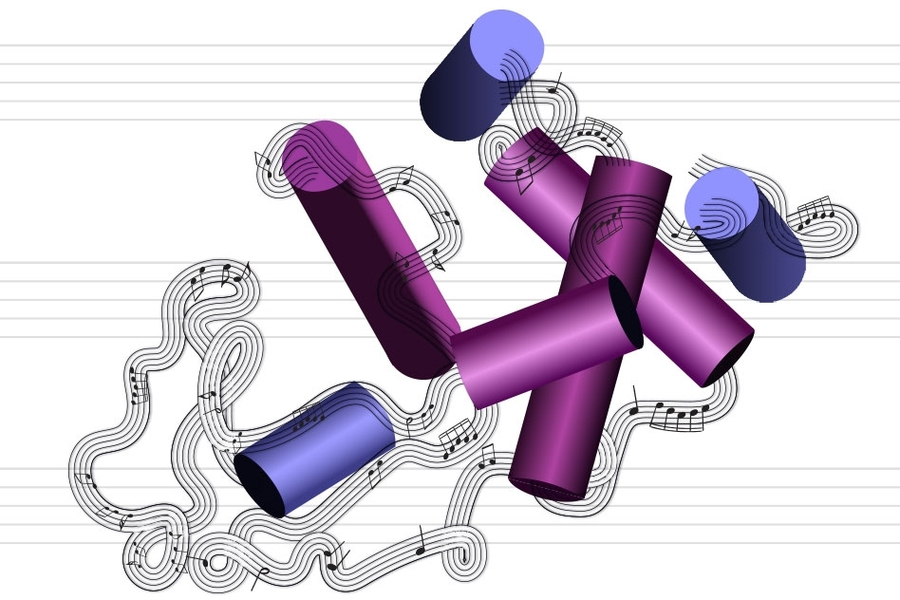

### O rumoreo da pandemia

>La impresión artística representa la conversión de la estructura de una molécula de proteína en un pasaje musical, como se hace en el sistema de los investigadores del MIT.

Imagen: Christine Daniloff, MIT

Uns científicos do  MIT (Instituto de Tecnoloxía de  Massachusetts) encabezados por *Markus Buehler* e o  postdoctorado *Chi  Hua  Yu* , están a traballar, dende o comezo da pandemia, nun proxecto para desenvolver novas proteínas a partir de modelos con IA e redes neuronais. O proxecto baséase en converter secuencias tridimensionales de material xenético en metadatos  que son traducidos a notas musicais. Estas secuencias, converterían en sons que á súa vez se percibirían polos nosos oídos como *formas sonoras en movemento*. É dicir, o modelo constrúe a estrutura da proteína directamente a partir da súa secuencia, traducindo patróns de  aminoácidos en xeometrías  tridimensionales que á súa vez serán un reflexo  algirítmico da devandita estrutura. Como o explicaba *Markus Buehler*, *é como traducir un conxunto de instrucións de IKEA nun andel*. 

A cuestión de  sonificar as secuencias de *ARN* foi  porque se precisaban novas maneiras de visualizar as súas estruturas para poder así crear novas proteínas. *Markus Buehler* ademais de científico é tamén músico,  esta dobre condición, permitiulle imaxinar unha procedemento onde integrar a música e a ciencia. 

> Como o explicaba Markus  Buehler, é como traducir un conxunto de instrucións de IKEA nun andel.

## Procedemento algorítmico 

As proteínas son os ladrillos cos que se constrúen as células e por iso o compoñente elemental (en grego : *πρωτεῖος* [prōteîos] fundamental, principal) de toda vida na terra. Son moléculas formadas por cadeas de  aminoácidos. 
O sistema, converte os vinte tipos de  aminoacidos nunha escala de 20 tons convertendo as secuencias da proteína en música, nunha sorprendente aplicación  da arte na ciencia ou viceversa. É posible que para persoas non educadas musicalmente estas representacións sonoras resulten estrañas e pouco musicais, pero unha escoita máis profunda pode levarnos a rememorar certas correntes musicais de mediados século  XX como o  experimentalismo americano e o  minimalismo. 
Buehler di que despois de escoitar as melodías resultantes, agora pode distinguir certas secuencias de  aminoácidos que corresponden a proteínas con funcións estruturais específicas. “Esa é unha lámina  beta”, podería dicir, ou “esa é unha hélice  alfa”.

Este método permite converter as secuencias de  aminoácidos aos diferentes parámetros polas que se rexe o son (ton, volume e duración) e o oído humano é capaz de diferenciar. Este proceso permite coñecer as semellanzas e as diferenzas das distintas familias de proteínas. 
Buehler atopa que as estruturas da proteína é xerárquica do mesmo xeito que a estrutura musical. O procedemento consiste en traducir as matrices dos  aminoácidos das proteínas a secuencias de sons rítmicos ou polo menos a unha especie de * tactus*  mecánico nun fluxo sonoro sen articulacións.
O equipo do  MIT utilizou un sistema de  IA para estudar un conxunto de melodías producidas por unha ampla cantidade de proteínas distintas, que fixeron que devandito sistema introducise lixeiros cambios na secuencia musical ou crease secuencias completamente novas, e logo traduciu os sons novamente a proteínas que corresponderían ás versións modificadas ou recentemente deseñadas. Con este proceso, puideron crear variacións de proteínas existentes, por exemplo, unha que se atopa na seda de araña, un dos materiais máis fortes da natureza, creando así novas proteínas diferentes ás producidas pola evolución. 

<iframe width="100%" height="300" scrolling="no" frameborder="no" allow="autoplay" src="https://w.soundcloud.com/player/?url=https%3A//api.soundcloud.com/playlists/1011610462&color=%233900ff&auto_play=false&hide_related=false&show_comments=true&show_user=true&show_reposts=false&show_teaser=true&visual=true"></iframe>

> Os sons de percusión, rítmicos e musicais que se escoitan aquí xéranse completamente a partir de secuencias de  aminoácidos.  

*A IA aprendeu a linguaxe de como se deseñan as proteínas* e pode codificalo para crear variacións de versións existentes ou deseños de proteínas completamente novos, di  Buehler. Dado que hai *trillons e  trillons* de combinacións potenciais, di, cando se trata de crear novas proteínas *non poderías facelo desde cero, pero iso é o que pode facer a  IA*.
Para  Buehler esta forma de codificar as estruturas musicais reflicte unha realidade máis profunda. “Cando miras unha molécula nun libro de texto, é estática”, di  Buehler. “Pero non é estática en absoluto. Móvese e vibra. Cada  pedacito de materia é un conxunto de vibracións. E podemos usar este concepto como unha forma de describir a materia”.

 Buehler coa súa concepción da materia parece lembrarnos as teorías actuais da física  cuántica sobre a Teoría de cordas -un mundo material que vibra rexido pola súa propia natureza-.

Existe una aplicación gratuita creada por el equipo de investigadores del MIT para teléfonos con sistemas Android disponible para descargar.

<iframe width="100%" height="166" scrolling="no" frameborder="no" allow="autoplay" src="https://w.soundcloud.com/player/?url=https%3A//api.soundcloud.com/tracks/633082110&color=ff5500"></iframe>

 > App Android: [Amino Acid Synthesizer] (https://play.google.com/store/apps/details?id=com.synth.aminoacidplayer&hl=es&gl=US)

> Fuente: [MIT.news](https://news.mit.edu/2019/translating-proteins-music-0626)
