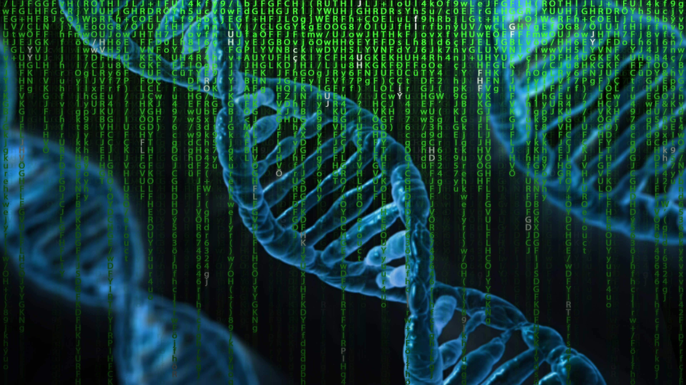

### O rumoreo da pandemia

Uns científicos do  MIT (Instituto de Tecnoloxía de  Massachusetts) encabezados por *Markus Buehler*, están a traballar nun proxecto para desenvolver novas proteínas a partir de modelos con IA e redes neuronais. O proxecto baséase en converter secuencias tridimensionales de material xenético en metadatos  que son traducidos a notas musicais. Estas secuencias, converterían en sons que á súa vez se percibirían polos nosos oídos como *formas sonoras en movemento*. É dicir, o modelo constrúe a estrutura da proteína directamente a partir da súa secuencia, traducindo patróns de  aminoácidos en xeometrías  tridimensionales que á súa vez serán un reflexo  algirítmico da devandita estrutura. Como o explicaba *Markus Buehler*, *é como traducir un conxunto de instrucións de IKEA nun andel*. 
A cuestión de  sonificar as secuencias de *ARN* foi  porque se precisaban novas maneiras de visualizar as súas estruturas para poder así crear novas proteínas. *Markus Buehler* ademais de científico é tamén músico,  esta dobre condición, permitiulle imaxinar unha procedemento onde integrar a música e a ciencia. 

> Como o explicaba Markus  Buehler, é como traducir un conxunto de instrucións de IKEA nun andel.

A cuestión de  sonificar as secuencias de *ARN* foi  porque se precisaban novas maneiras de visualizar as súas estruturas para poder así crear novas proteínas. *Markus  Buehler* ademais de científico é tamén músico,  esta dobre condición, permitiulle imaxinar unha procedemento onde integrar a música e a ciencia.

## Procedemento algorítmico 

As proteínas son os ladrillos cos que se constrúen as células e por iso o compoñente elemental (en grego : *πρωτεῖος* [prōteîos] fundamental, principal) de toda vida na terra. Son moléculas formadas por cadeas de  aminoácidos. 

