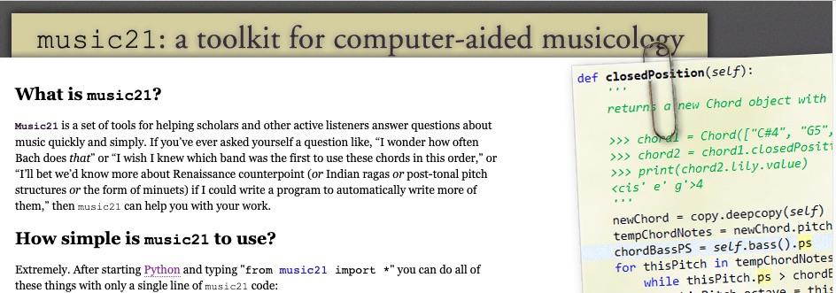
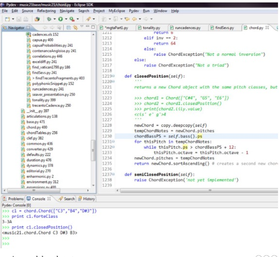
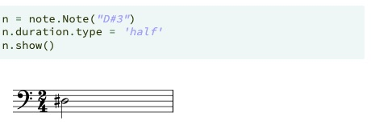
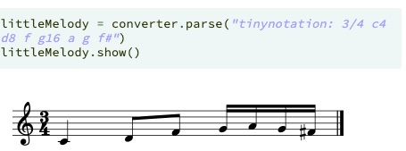
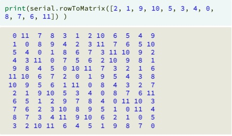
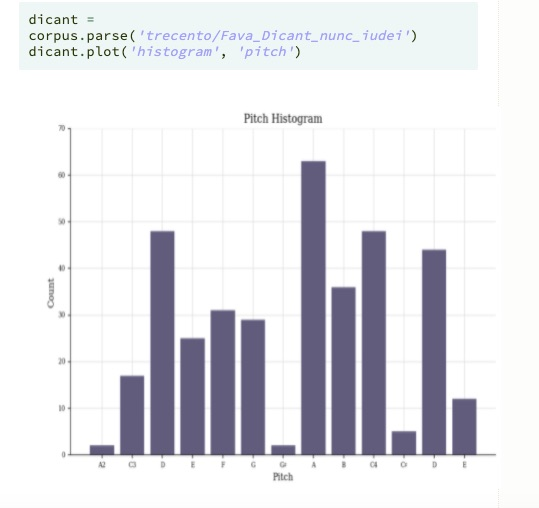
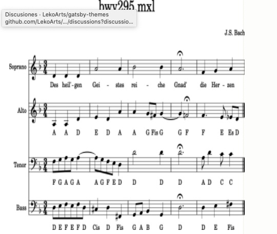

Music21 é un conxunto de ferramentas baseado en  Python para unha musicoloxía computacional. 

Unha das capacidades desta ferramenta é a de permitir estudar unha gran cantidade de conxunto de datos de música. 
Así mesmo pódense xerar exemplos musicais,  ensinar os fundamentos da teoría musical, editar notación musical e compoñer música (tanto  algorítmicamente como directamente) .
Esta aplicación creouse no ano 2008 e os seus autores principais son:
Michael  Cuthbert , o creador de  music21 , é Profesor Asociado de Música no  MIT. Recibiu o seu  AB  summa  cum laude , AM e  Ph.D. graos da Universidade de  Harvard.  Cuthbert pasou 2004-05 na Academia Estadounidense como gañador do Premio Roma en Estudos Medievais, 2009-10 como membro do Centro Villa I  Tatti de  Harvard para Estudos do Renacemento Italiano en  Florencia, e 2012-13 no Instituto Radcliffe. 
Ademais de traballar en  music21,  Cuthbert actualmente está a escribir un libro sobre música sacra en Italia durante a era da Peste Negra e o Gran Cisma Papal.
Christopher  Ariza é programador principal emérito de  music21 e foi profesor asistente visitante de música no  MIT de 2010 a 2013. Antes de unirse ao proxecto  music21 ,  Ariza foi profesor asistente de tecnoloxía musical na Universidade de  Towson en Baltimore. Publicou e presentou numerosos artigos e relatorios sobre composición  algorítmica e sistemas musicais xenerativos.  Ariza recibiu o seu grao A. B. da Universidade de  Harvard e o seu grao de Doutor na Universidade de Nova York.

## O MIT o centro de investigación de Music21

 

 21  en   music21 fai referencia ás súas orixes como un proxecto nutrido no  MIT. No  MIT, todos os cursos teñen números e música, xunto con algúns outros departamentos de humanidades, están numerados 21. Os departamentos de música do  MIT, xunto coas universidades de  Harvard, Smith e  Mount  Holyoke, axudaron a levar este conxunto de ferramentas desde as súas raíces máis sinxelas a un sistema maduro.

## Qué pode facer Music21.

Para comezar a utilizar Music21, non fai falta ter unha gran experiencia en programación. Aínda que si é recomendable obviamente, ter uns mínimos coñecementos da linguaxe Python  para entender os algoritmos implementados por esta ferramenta. 

A partir da importación da biblioteca  podemos facer un primeiro achegamento pasando por pantalla unha nota. 

'from music21 import*'

 

Na primeira liña, a variable ' n' asignámoslle o módulo da biblioteca de  python note* (os módulos escríbense con minúscula) e o obxecto  Note*. Entre paréntese, pásase o argumento como un * string* da nota que se queira representar, no noso exemplo é un * re* sostido ('D#').
Na segunda liña, dámoslle unha duración á nota, neste  cvasoa  través do módulo * duration*, valor de branca (os valores poden ser  whole,  half,  quarter, etc..)
Por último, imprimimos a nota (variable * n*) a través do método  show* .

Podemos facer unha frase completa a través das seguintes liñas:

   

Creamos unha variable  littleMelody a través do módulo * converter* (contén ferramentas para cargar música desde varios formatos de arquivo, xa sexa desde un disco, desde a web ou desde texto e convertelos en obxectos  music21). A través da función * parse* pasámoslle un argumento en forma de * string* , encabezada pola palabra  * tinynotation* , o compás e con todas as notas que queremos que integren a melodía. A cada unha delas o achegamos un número que representará as súas duracións. 
Se queremos escoitar a melodía do exemplo pasámoslle á variable  littleMelody a función .show(' midi') e como o  string * midi*.

## Análise de música do século  XX.
 As técnicas analíticas aplicables á música do século  XX tamén teñen en Music21 unha ferramenta de primeira orde para o seu estudo.
 Por exemplo, vexamos a matriz a partir da serie de tons na apertura do cuarteto de corda de Arnold  Schoenberg.
  
 

 Nunha composición musical, pódese buscar  cuan comúns son varios tons: neste exemplo, unha composición do século  xiv. 

  
 
 Algúns destes exemplos utilizados neste artigo, dun corpus de obras propio de Music21 onde están integradas, miles de pezas de libre uso para estudar. Por exemplo, neste corpus están incluídos todos as corais de  Bach. No seguinte exemplo, accedemos ao coral de  Bach,  BWV 295 e agregamos o nome da nota en  aleman.

'
bwv295 = corpus. parse(' bach/ bwv295')
for  thisNote  in  bwv295. recurse().notes:
   thisNote. addLyric( thisNote. pitch. german)
bwv295.show()
'

 

Para terminar esta breve presentación, Music21 pode ser unha ferramenta simple de usar, pero tamén é extremadamente poderosa. Como todo software (Photoshop comparado con  MS  Paint,  AutoCAD, Excel), hai unha pequena curva de aprendizaxe, especialmente para as persoas que non programaron antes.

Para usar  music21, como xa comentamos máis arriba, necesítase certa familiaridade coa linguaxe de programación " Python".  Python é amplamente considerado como un das linguaxes máis fáciles de aprender e, a miúdo, ensínase como primeira linguaxe de programación. Non é necesario ser un programador experimentado; só un pouco de  Python e poderase comezar e explorar a música de novas maneiras con  music21.